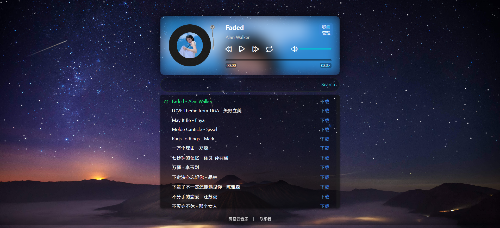

# 在线音乐播放器

这是一个在线音乐播放器，集成api增加删除歌曲，可批量添加或删除，支持的音乐格式: mp3/wav/flac/m4a



## Hugging Face Spaces部署
#### 第一种方式：打包Docker镜像,使用抱脸SDK创建Player
先在抱脸创建Access Tokens写权限，再Github Actions一键部署到Hugging Face
或者直接使用我的Docker镜像
Dockerfile
```
FROM ghcr.io/zxlwq/player:latest
```
#### 第二种方式 原源代码部署
新建Spaces选择Docker空白的模板
#### 添加环境变量
New Variables
```
GIT_REPO
```
New Secrets
```
GIT_TOKEN
```
New Secrets
```
ADMIN_PASSWORD
```
在README.md添加一行
```
app_port: 3000
```
新建Dockerfile
```
FROM node:18-alpine

RUN apk add --no-cache git bash curl

WORKDIR /app

ARG GIT_TOKEN
ARG GIT_REPO
ARG ADMIN_PASSWORD

RUN rm -rf /app/* \
&& git clone https://${GIT_TOKEN}@github.com/${GIT_REPO}.git . \
&& npm install

EXPOSE 3000

CMD ["node", "app.js"]
```

## VPS部署

### 源代码部署
* 安装nodejs环境,可直接使用工具箱一键安装或使用下列命令安装
```
apt-get update -y
curl -fsSL https://deb.nodesource.com/setup_lts.x | sudo -E bash - && install nodejs
```
* 部署主体项目
```
apt install git screen -y
git clone https://github.com/zxlwq/Player
cd Player && rm -rf Dockerfile README.md .github
npm install
screen npm start 
```

### Docker一键部署

* 管理密码环境变量：`ADMIN_PASSWORD`

```
zxlwq/player
```
### Docker-compose一键部署
```bash
version: '3'

services:
  music-player:
    image: zxlwq/player:latest
    ports:
      - "3000:3000"
    volumes:
      - music-data:/app/music
    environment:
      - PORT=3000
    restart: unless-stopped

volumes:
  music-data:
```

## api
获取音乐列表:
```请求方式：GET```
```
https://你的域名/api/music/list
```

下载音乐到服务器：
```请求方式：GET```
```环境变量 ：url 必须，name 非必须```
```
https://你的域名/api/download?url=音乐下载链接&name=保存后的歌曲名-歌手名
```

删除音乐：
```password为管理密码,name或names为歌曲名，必填```
方式：POST

```删除单首```
```
https://你的域名/api/delete/music?password=管理密码&names=歌曲名
```
```删除多首```
```歌曲名之间用英文逗号分隔```
```
https://你的域名/api/delete/music?password=管理密码&names=歌曲名1,歌曲名2,歌曲名2
```

```删除所有```
```慎用```
```
https://你的域名/api/delete/music?password=管理密码&all=true
```

## 音乐直链链接
```支持的格式: mp3/wav/flac/m4a```

https://你的域名/music/歌曲名-歌手.文件后缀名
